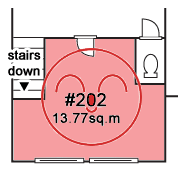

Mon premier séjour au Japon! 
3 mois de 2005, beaucoup d'automne et un peu d'hiver.
Et ma chambre portait le numéro 202... À l'époque ça paraissait cool...

Il y avait des [objets du jour aussi]().

Suivront les projets [204]() et [201]()